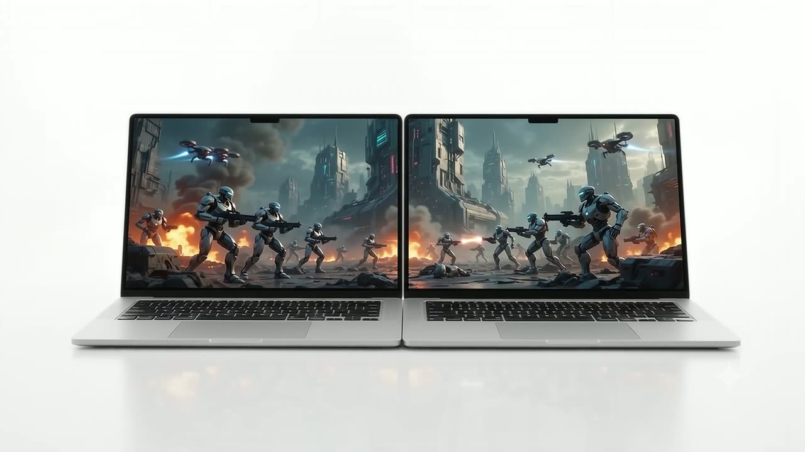

<p align="center">
  
</p>

<h1 align="center">CineWall</h1>

<p align="center">A wider movie screen. A shared speaker room. The laptops you already own.</p>

<p align="center">
  <a href="https://watch.aitoyz.in/">Website</a> ·
  <a href="#video-tutorial">Demo</a> ·
  <a href="#quick-start">Quick start</a> ·
  <a href="https://github.com/AryanETH/Cine-wall/issues">Report an issue</a> ·
  <a href="#contribute">Contribute</a>
</p>

<p align="center">
  
  
  
</p>



CineWall brings nearby laptops together for movies, music and live screen sharing. Choose a file on one laptop, open its numbered links on the others, and control playback from one dashboard. Only the source laptop needs the file.

Use two or three screens for a wider movie view, up to five laptops for music, or share a tab, app window or desktop. CineWall can run from the website or from a local server on your Wi-Fi or hotspot.

## Why CineWall?

- **Movie nights:** turn laptops placed side by side into a wider picture.
- **Shared music:** play a playlist around the room, with separate volume and mute controls.
- **Lessons and demos:** show an app or live screen on other devices.
- **Use what you have:** bring spare laptops into the setup without special movie-wall hardware.

One screen is enough for everyday watching. CineWall is for when you want a larger combined view or sound from several devices. Laptop bezels stay visible, and Wi-Fi and browser performance affect the experience.

## Features

| Mode | Devices | Current status |
| --- | --- | --- |
| Video wall | 2–3 recommended; can reduce to 1 | Available |
| Audio room | 1–5 speakers | Available |
| Screen sharing | Up to 10 numbered screens, plus the presenter | Available · phones, tablets and laptops |
| Room calls | Up to 4 devices | Available · optional mic and camera |
| Presentation wall | Up to 3 displays | In development · share a slides/document window with Screen sharing instead |
| Live YouTube wall | 2–3 displays | In development · homepage marked Coming soon |

### Video and audio

- One source laptop; other laptops cannot replace its file until it is removed.
- Shared play, pause, seek and per-laptop sound controls.
- Space to play/pause; left/right arrows or a double-click on either side to skip 10 seconds.
- Play becomes available after every selected screen reports the current file ready.
- **Instant** and **Server** file-sharing options.
- Video **Fit**, **Crop** and **Stretch** framing; Stretch is the preset.
- A silent, ten-second video preview and Replay when the movie ends.
- Audio playlists of up to ten songs, drag-to-reorder and automatic next-song playback.
- Current song names on the dashboard and speaker screens.
- **Personal** and **3D mode** sound settings, plus individual volume and mute.
- Light and dark themes, a first-use dashboard guide and connection feedback.

### Live screen sharing

- Share a browser tab, app window or entire screen through the browser's picker.
- Mirror the whole view on every screen; this mode does not split the picture.
- Add up to ten numbered receiver screens. Phones and tablets can watch; use desktop Chrome or Edge to start capture.
- Join a room call on up to four devices with separate microphone and camera switches, live camera tiles and a leave button.
- Mic and camera start off. Joining a call only listens; each person chooses when to enable their devices.
- Calls continue when screen sharing stops. Use one call tab per laptop and headphones to reduce echo.
- Auto, 720p and 1080p quality choices.
- Auto reduces video traffic and capture size as more screens join, leaving room for audio. Every receiver uses the same low-delay buffering preference where the browser supports it.
- A shared pointer for pointing inside the view.
- Horizontal flip for a teleprompter.
- Receiver sound controls, fullscreen and reconnection.
- Stop sharing from CineWall or the browser's own stop button.

> [!NOTE]
> Screen sharing shows a chosen view. It does not create extra desktop space or control another computer's system mouse and keyboard.

## Video tutorial

[](https://www.youtube.com/watch?v=nKjiv6_XSN4)

[Watch the tutorial on YouTube](https://www.youtube.com/watch?v=nKjiv6_XSN4). You can also use **Tutorial** on any dashboard. The homepage includes a click-to-play tutorial, setup guide, use cases and FAQs.

## Download and requirements

[Download the source ZIP](https://github.com/AryanETH/Cine-wall/archive/refs/heads/main.zip), or clone the repository. Extract the ZIP before starting CineWall.

| Requirement | What you need |
| --- | --- |
| Local server | Node.js 18 or newer on the source laptop |
| Playback | A current browser that supports the selected video/audio tracks; desktop Chrome or Edge is the recommended setup |
| Connection | The same Wi-Fi or hotspot for local sharing, with device-to-device connections allowed |
| Screen capture | Desktop browser capture support; open the HTTPS website or localhost on the source laptop |
| Windows shortcuts | Included `START CINEMA.cmd` and optional `SETUP DOWNLOADS.cmd` |
| Optional downloads | yt-dlp and FFmpeg; the setup script installs them locally |

The Windows launchers and Office conversion tools are designed for Windows. The Node server and browser pages may work on other operating systems, but full cross-platform support has not been verified. Mobile devices can receive a shared screen where their browser supports it; starting screen capture on mobile depends on browser support.

## Quick start

### Use the website

1. Open [watch.aitoyz.in](https://watch.aitoyz.in/) on the source laptop.
2. Connect your other laptops to the same Wi-Fi or hotspot for Instant sharing.
3. Choose Video or Audio and select your file.
4. Add only the screens or speakers you need. Open each numbered link on its matching laptop.
5. Wait for them to be ready, then press Play. Tap to enable sound on a laptop if asked.

The first laptop to choose a file becomes admin. Display/Speaker 1 is that laptop, and its player opens in a separate tab. Keep the source dashboard open for Instant mode.

### Run locally on Windows

1. Install Node.js, then extract or clone CineWall.
2. Double-click **START CINEMA.cmd** and keep the server window open.
3. Allow Node.js on **Private networks** if Windows Firewall asks.
4. Open the printed Start address, normally `http://localhost:4173/`.
5. Choose Video or Audio, select a file and open the generated screen links on the other laptops.

The local setup works without internet for local movie/audio files. If port 4173 is busy, CineWall tries the next free port. Use the links from the current dashboard rather than an old saved address. Stop the server with `Ctrl+C`.

### Start from a terminal

```sh
git clone https://github.com/AryanETH/Cine-wall.git
cd Cine-wall
node server.js
```

The server has no npm package dependencies to install. Optional download tools are set up separately.

## Instant or Server?

| | Instant | Server |
| --- | --- | --- |
| Starts sharing | From the selected local file, without a full upload | After a full copy is uploaded and checked |
| On the website | File ranges pass directly between browsers on the same local network | Screens receive media from the hosting server |
| Running locally | Uses the local sharing path; plain HTTP can forward through the local server | Saves a copy to the local server's cache |
| Source dashboard | Must stay open; laptop must stay awake | Not needed to serve uploaded media once preparation finishes |
| Progress | Connection and startup readiness | Upload progress and startup readiness |
| Movie conversion | None | None |

Online Instant mode exchanges room and playback messages through the website, but keeps movie/audio bytes off the hosting server. Its local-network route has no silent server-upload fallback. Guest networks, hotspot isolation or firewalls can prevent a connection; use a network that allows laptops to reach one another or choose Server.

A screen's loading percentage measures readiness to start, not a complete movie download. Browser-based sharing cannot identify your Wi-Fi name.

## Sound and playlists

**Personal** plays the full sound on each laptop. **3D mode** spreads the recording's left/right stereo sound in screen-number order and rebalances when devices are added or removed.

| Laptops | 3D sound positions |
| --- | --- |
| 2 | Left · Right |
| 3 | Left · Centre · Right |
| 4 | Left · Centre-left · Centre-right · Right |
| 5 | Left · Centre-left · Centre · Centre-right · Right |

Video supports up to three screens; audio supports up to five speakers. This spreads existing stereo sound rather than creating Dolby Atmos. Mono recordings remain mono. Each laptop's volume and mute control still works.

Add up to ten songs in Audio, then drag them into order. When the current song ends, CineWall loads the next and waits for every selected speaker to be ready before starting it. The source dashboard holds the playlist, so keep it open.

Nearby speakers can echo because laptops have different output delays. Lower or mute individual speakers if needed.

## Share a live screen

1. Choose the active **Screen sharing** homepage card or **Share screen** on a dashboard. YouTube streaming stays Coming soon.
2. On desktop Chrome or Edge, open the HTTPS website or localhost and press **Share screen**.
3. Choose a tab, window or display in the browser's picker.
4. Use **Add screen** to create up to ten links. Open them on phones, tablets or laptops on the same Wi-Fi.
5. Every screen sees the whole view. Adjust quality, flip or pointer settings as needed.
6. Press **Stop sharing** when finished.

Screen sharing sends captured media through WebRTC without a server upload. It has its own room state and does not replace a movie/audio session.

For a call, press **Join call** on each laptop, then turn on **Mic** or **Camera** if wanted. **Invite to room** copies the same room link. Camera and mic need HTTPS (or localhost), browser permission and a connected microphone/camera. Calls use direct connections on the same Wi-Fi, just like screen sharing; there is no internet relay or recording. Press **Leave call** to stop your camera, mic and incoming call audio.

Receivers start muted to prevent feedback. **Enable sound** works when the chosen source includes audio. Tab sharing with the browser's Share audio option is usually the simplest choice; window and desktop audio support varies.

For lower sound delay, leave quality on **Auto**, keep the presenter awake, use a strong Wi-Fi signal and avoid Bluetooth speakers. Audio gets priority over screen video when supported. Browser buffering preferences are not a promise of identical output timing: device sound drivers, Wi-Fi jitter and speaker delays still vary. Headphones are best for a call. Ten screens are supported by the room and links; practical smoothness depends on the presenter's hardware and network. The presenter sends a separate stream to each viewer, so more viewers use more upload bandwidth and encoding work.

The shared pointer is an annotation inside CineWall. For one mouse and keyboard across entire desktops, use a native app such as [Deskflow](https://github.com/deskflow/deskflow). A true extended desktop also needs a desktop display-sharing solution and a virtual display or display adapter. Screen sharing uses direct connections and has no TURN relay fallback.

## Supported files

| Media | Working choices |
| --- | --- |
| Video | MP4/M4V with supported H.264, VP9 or AV1 configurations and AAC audio |
| WebM video | Supported VP8/VP9 video with Opus audio |
| MKV video | Selected H.264 profiles with supported AAC audio tracks |
| Audio | MP3, WAV, AAC, M4A, OGG/OGA, FLAC and browser-supported WebM audio |

**MP4 with H.264 video and AAC audio is the safest movie choice.** Every receiving browser must support the file's tracks. An MP4 or MKV extension alone does not guarantee compatibility.

CineWall checks selected movies and rejects unsupported tracks, including HEVC/Dolby MKV. It does not convert movies; convert an unsupported file outside CineWall first. DRM-protected streaming services are not supported.

## YouTube downloads

YouTube downloads are separate from the upcoming live YouTube wall. Use the **YouTube** tab beside the local file choice on a Video or Audio dashboard.

1. On Windows, run **SETUP DOWNLOADS.cmd** once to install the optional tools. Run it again to update them.
2. Paste a YouTube link and choose **Search**.
3. Select an available format and quality, then download.
4. Save the result or use a supported result in CineWall.

Choices can include MP4/WebM video, MP3 at 96–320 kbps, original M4A audio and WAV, depending on the video. MP3 output settings do not improve source quality. Downloads have progress and cancellation, a 10 GB limit, and one active job at a time.

The downloader retries alternate streams and official API routes for certain failures. Updates to yt-dlp can help when YouTube changes. Sign-in restrictions, rate limits and blocked connections can still prevent a download. Only download content you own or have permission to save.

The tools and cache stay in `tools/` and `.cinema-cache/`, which are excluded from Git. The Docker image includes download tools for hosted use.

## Hosting

The repository includes a [Dockerfile](Dockerfile) and [Railway configuration](railway.toml). Use a host that runs a long-lived Node process, serves HTTPS and supports event-stream connections.

| Setting | Purpose |
| --- | --- |
| `PORT` | Server port; defaults to 4173 |
| `CINEWALL_HOSTED=1` | Requires private room IDs for hosted API/event requests |
| `CINEWALL_CACHE_DIR` | Location for temporary uploads and download cache |

Deploy both the server and public files, then reload the dashboards and player tabs. Server mode needs enough disk space and upload allowance for the chosen files. Temporary storage may disappear when a hosting instance restarts. Live screen captures and Instant source tabs do not survive a source-browser restart.

## FAQs

### If I can watch on one screen, why use more?

You don't need to. CineWall lets you combine laptops you already own into a wider movie view, share music across devices or show a live app to others. Bezels and extra setup are the trade-off.

### Does each laptop need the same movie?

No. Select it on the source laptop only. The other laptops receive it through the selected sharing mode.

### Why are rooms different on the same hotspot?

Wi-Fi connects devices, but it does not identify a room on the public website. Open the admin's numbered links, which contain the same room ID. Laptops using the same local CineWall server share its local room.

### Why does Play wait for other screens?

CineWall waits until every selected screen is ready for the current file. Open missing screens, resolve their error or remove an unused screen.

### Why does sound need a tap?

Browsers can block audio until you interact with a page. Enable sound once on that laptop, then continue from the admin controls.

### Does fullscreen start automatically?

CineWall attempts fullscreen, but browsers may require a click. Use the fullscreen button when prompted. You can exit it normally.

### Why does one MKV work and another fail?

MKV is a container. The video and audio inside it can use different codecs, and each browser/laptop must decode them. Try H.264 video with AAC audio; HEVC or Dolby tracks can be unsupported.

### Can I share a screen without adding a virtual monitor?

Yes, to show an existing tab, window or display. To create additional desktop space, you need a native display solution.

### Can phones and tablets join? How many screens?

Yes. Screen sharing supports up to ten numbered screens, plus the presenter. A phone or tablet opens a screen link to watch the full view. Start capture from desktop Chrome or Edge. Optional mic/camera calls support four devices at once; the other screens can still watch and hear the shared source.

### Can I show slides? Is live YouTube ready?

Use the active **Screen sharing** card to share your slides, PDF or document window. The separate Presentation wall remains development code rather than a homepage mode. Live YouTube streaming stays Coming soon; YouTube downloads in Video and Audio are already available.

## Troubleshooting

| Problem | Try this |
| --- | --- |
| A screen link times out | Use the current link, the same non-guest Wi-Fi/hotspot and allow Node.js through the local firewall |
| Different rooms | Open links copied from the same admin dashboard |
| Instant cannot connect | Keep the source tab open and laptop awake; check local-network permission, firewall and device isolation, or choose Server |
| Audio is blocked | Tap Enable sound on that laptop |
| A movie is rejected | Try an H.264/AAC MP4; check the codecs, not just its extension |
| Screen sharing is unavailable | Start capture in a supported desktop browser on HTTPS or localhost |
| Screen sharing has no sound | Share a source with audio and enable Share audio in the browser's picker |
| Shared sound lags or cuts out | Choose Auto quality, use strong Wi-Fi and avoid Bluetooth audio; fewer viewers reduce load |
| The picture or sound drifts | Use a strong connection, plug laptops into power, avoid sleep and reduce competing network activity |
| YouTube download fails | Update the download tools and check the video's availability and network access |

For a movie wall, match screen heights, resolution, brightness and scaling where possible. Use the correct numbered link for each position.

## Contribute

Bug reports, documentation improvements, accessibility fixes and code contributions are welcome.

- [Report a bug or suggest a feature](https://github.com/AryanETH/Cine-wall/issues).
- Include the mode, browser, operating system, local/online setup and steps to reproduce.
- For playback issues, include the codecs and error message when available.
- Keep changes focused and test the affected flow before opening a pull request.

### Development checks

```sh
npm run check
npm test
```

The checks cover syntax, sharing/room behavior, file validation, audio queues and UI logic. Some integration checks start a temporary local server and need network and temporary-file access. Office preparation and optional download tests need their relevant tools installed.

## Related projects

- [Deskflow](https://github.com/deskflow/deskflow) — share one mouse and keyboard across computers.
- [Deskreen](https://github.com/pavlobu/deskreen) — desktop screen sharing, with extended-display setups using a display adapter.

These projects solve related problems. CineWall is independently developed and is not affiliated with them.

## Support the project

Use **Support this project** on the website, enter an amount and generate a UPI QR. Payment goes to `6260976807-3@ybl` and is completed in your UPI app. CineWall does not collect banking details; QR generation uses an external image service and needs internet.

Built by [Aryan](https://www.linkedin.com/in/aryan686/).

## License and credits

A project-wide license has not yet been specified in this repository.

Bundled or optional components keep their own licenses:

- [Mozilla PDF.js](https://github.com/mozilla/pdf.js) — Apache-2.0; [bundled license](public/vendor/pdfjs/LICENSE).
- [yt-dlp](https://github.com/yt-dlp/yt-dlp) and [FFmpeg builds](https://github.com/yt-dlp/FFmpeg-Builds) — optional download tools with their own upstream licenses.
- [Anta](https://github.com/google/fonts/tree/main/ofl/anta) — [SIL Open Font License](public/fonts/OFL.txt).
- The Screen sharing card uses an AI-generated [thumbnail](public/assets/screen-sharing-team.webp); its generation prompt and optimization details are saved [here](docs/asset-prompts/screen-sharing.md).
